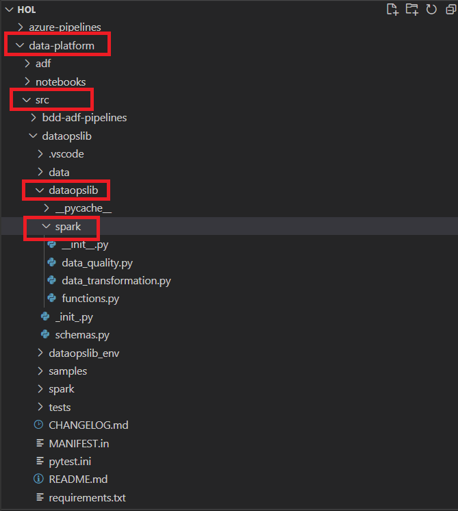
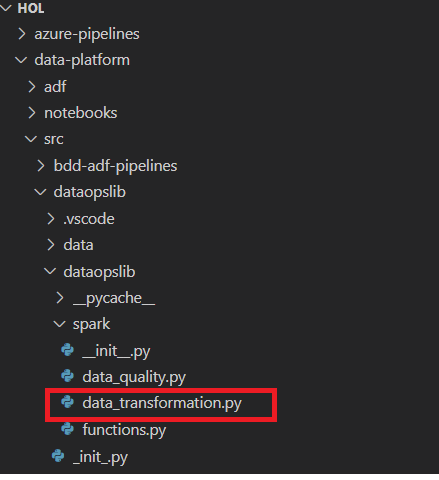

### **Task 2: Exploring the Python custom libraries**

In previous task we explored the databricks notebook, and we used a custom library responsible for the main transformations in the data sets of flights delays and whether. Now, let’s to explore and understand some approaches to creating custom libraries in data analytics projects.

>**Important Note**
_Please note that we will use existing custom libraries in the repository, won’t be necessary to develop a new library to this exercise._


***For the remainder of this guide, the following pre-requirements will be necessary to execute and validate the library locally:***

*	**Python 3.8**
*	**Docker + Docker Compose**
*	**Java SDK 11**
    * Instruction to Install

       ```
           sudo apt-get update
           sudo apt-get install default-jdk
        ```
*	**Visual Studio Code**
    * ***Extensions Required***
      1. Python Pylance (Extension ID: ms-python.python)
      2. Remote WSL


1. Open the HOL directory in your prompt and execute **“code .”**  to open the Visual Studio Code:

  

2. From the left explorer view, open the **“data-platform/src/dataopslib/dataopslib””** directory structure. 

  

3. Inside the structure you will see the codes used for the development of libraries that are current used in the databricks notebook. 
For that, open the **“spark”** directory and click on the file **“data_transformation.py”**



4. If you look in the code library, will notice that there is a lot of functions that is used in the databricks notebooks to address data cleanings and transformations. Let’s look at one of them. Press *CTRL+F* type **“make_datetime_column”** and click OK. You will see that in this part of the code, we are using is a pretty common practice for some datasets:

```
def make_datetime_column(df: DataFrame, columnName: str, year: str, month: str, day: str,
                         hour: Union[str, None] = None, minute: Union[str, None] = None,
                         second: Union[str, None] = None, time: [str, None] = None,
                         timeFormat: str = 'HH:mm:ss') -> DataFrame:
    """Buils a new `Timestamp` column based on string columns containing each of the parts of the date. If time-related columns are indicated,
    time is constructed based on local time zone. If not, a `DateTime` column is constructed. Missing values are rounded down to the minute/hour.

    Parameters
    ----------
    df : DataFrame
        The dataframe where the data is contained
    columnName : str
        the column to build
    year : str
        Column containing the year
    month : str
        Column containing the month
    day : str
        Column containing the day
    hour : Union[str, None], optional
        Column containing the hour, by default None
    minute : Union[str, None], optional
        Column containing the minute, by default None
    second : Union[str, None], optional
        Column containing the second, by default None
    time: Union[str, None], optional
        Column containing the time part to construct the date column. This argument can't be combined with `hour`/`minute`/`second`
    timeFormat: str, optional
        When `time` is indicated, `timeFormat` represents the format where time column is stored, by default 'HH:mm:ss'
    Returns
    -------
    DataFrame
        The dataframe with the new column appended.
    """
    if timeFormat and not time:
        raise ValueError("You can't specify timeFormat if time is missing.")
    if time and (hour or minute or second):
        raise ValueError("You can't specify both time and hour/minute/second. Either use one or the others")
    if not second:
        logger.info("Seconds not specified. Minutes will be rounded down")
        second = f.lit("00")
    if not minute:
        logger.info("Minutes not specified. Hours will be rounded down")
        minute = f.lit("00")

    if not (hour or time):
        logger.info(f"Building a date column from columns '{year}', '{month}' and '{day}'")
        return parse_to_date_column(concat_columns(df, columnName, year, month, day, union_char='-'), columnName, 'yyyy-M-d')
    else:
        logger.info('Building a datetime column from columns {}'.format([year, month, day, hour, minute, second, time]))
        df = concat_columns(df, '__date_part', year, month, day, union_char='-')
        if not time:
            df = concat_columns(df, '__time_part', hour, minute, second, union_char=':')
        else:
            df = parse_to_time_column(df, time, timeFormat, '__time_part')

        df = concat_columns(df, columnName, '__date_part', '__time_part', union_char=' ')
        df = parse_to_datetime_column(df, columnName, 'yyyy-M-d HH:mm:ss', columnName)
        df = drop_columns(df, '__date_part', '__time_part')

        return df
```


5.	From the left menu explorer, you will see others library, but before to execute and test them locally you will need to setup the configuration of the environment. For that, follow the steps **6** and **7**.


6. Open **data_platform/src/dataopslib** create a virtual environment and install the required packages:

    ```sh
      python3 -m venv dataopslib_env
      source dataopslib_env/bin/activate

	  code . 
	  
      pip3 install wheel
      pip3 install -r requirements.txt
    ```

7. Open **data_platform/src/spark** folder on your terminal and run the Docker compose to start an Apache Spark instance locally:

    ```sh
       docker-compose up
    ```


8. Now we already have the environment prepared and to start the execution of some existing libraries. Choose more one sample to test, open the samples folder, click on the file **“sample_read_csv.py”** and press F5.

  


10. Until we were able to abstract certain functions inside a library and reuse them in the notebooks. But now, let’s imagine that we need to create a new feature for this library, or maybe fix a bug, how to versioning this code?  Let's to learn that in the **Task 3: The Git Workflow for Data Engineering**


